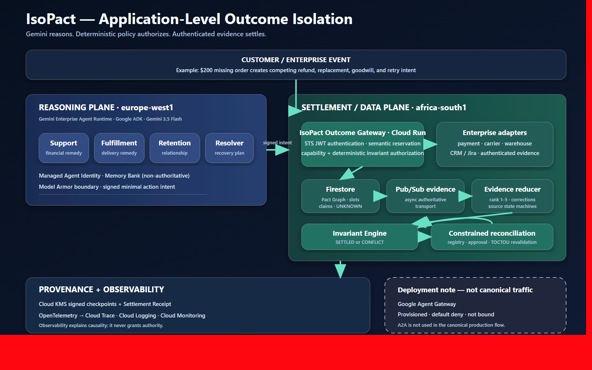

# IsoPact

> A closed ticket is not a settled outcome.

A customer says a $200 order never arrived. Support refunds $200. Fulfillment replaces $200. Retention adds $50 goodwill. A second support workflow refunds another $200. Every agent can look locally correct while the business projects $650 of compensation—$450 above the original obligation.

IsoPact places an application-level **Outcome Pact** beneath the fleet. Gemini interprets intent; deterministic policy owns consequential authority; authenticated evidence determines settlement. In the protected scenario, one $200 primary remedy and $50 goodwill are authorized, while the replacement and duplicate refund are blocked: $250 authorized compensation and $400 of projected invalid value prevented.

## The problem

Enterprise agents optimize legitimate local goals, but agent completion is not business settlement. Existing gateways authenticate calls, workflow engines coordinate known steps, and payment idempotency deduplicates one provider operation. None alone governs the combined business obligation produced by independent agents and systems.

IsoPact does **not** claim cross-SaaS ACID, distributed atomicity, or storage-level immutability. It provides application-level outcome isolation.

## The 30-second demo

Open the [live judge UI](https://isopact-outcome-gateway-442539309409.africa-south1.run.app/), select **Protected Outcome**, reset, and play:

1. Support refund: `ALLOW`.
2. Fulfillment replacement: `BLOCK`.
3. Duplicate refund: `BLOCK`.
4. Support becomes `COMPLETE`, while the business remains `NOT SETTLED`.
5. Rank 1 settlement evidence arrives and the pact becomes `SETTLED`.
6. Open the receipt and verify its KMS-backed integrity; tampering returns `INVALID`.

## Why multi-agent systems need this

Support, Fulfillment, Retention, and the Settlement Resolver have separate tools, identities, and valid objectives. Collapsing them into one orchestrator hides the real enterprise boundary: independently deployed teams and systems can all succeed locally while creating a contradictory global outcome. IsoPact governs their shared obligation without giving any model settlement authority.

## Architecture

The reasoning plane runs four specialized Google ADK agents in Gemini Enterprise Agent Runtime (`europe-west1`). They use Gemini 3.5 Flash for intent compilation and constrained reconciliation, with managed Agent Identity, non-authoritative Memory Bank context, and Model Armor screening.

Minimal signed action intent crosses to the IsoPact Outcome Gateway on Cloud Run (`africa-south1`). The gateway authenticates identity, reserves semantic operations in Firestore, applies capability and invariant checks, calls enterprise adapters only after commit, and records ambiguous transport outcomes as `OUTCOME_UNKNOWN` rather than retrying blindly. Pub/Sub carries evidence to a ranked reducer; deterministic rules decide settlement or conflict. Cloud KMS signs checkpoints and receipts. OpenTelemetry feeds Cloud Trace, Logging, and Monitoring but never controls authority.



Agent Gateway was provisioned and evaluated but remains `CREATED_DEFAULT_DENY_NOT_BOUND`; canonical traffic does not pass through it. A2A is not used in the canonical production flow.

## Key safety guarantees

- Semantic operation identity prevents duplicate consequential execution under the modeled identity—not a universal exactly-once claim.
- Exclusive resolution slots prevent competing primary remedies from both acquiring authority.
- External calls happen after durable reservation; uncertain calls become persistent `OUTCOME_UNKNOWN`.
- Authoritative evidence ranks agent statements below authenticated settlement sources.
- Closed compensation types, human approval, and TOCTOU revalidation constrain reconciliation.
- Append-oriented claims, hash chains, and KMS checkpoints make recorded-history tampering detectable; Firestore itself is not immutable.

## Benchmark

In our frozen Stage 12 benchmark (`stage12-v1.0.0`):

- 130 deterministic cases, including 39 held-out cases
- 2,500 generated property cases and 30 injected failures
- contradiction recall: 100% (95% Wilson CI 94.34%–100%)
- contradiction precision: 100% (95% Wilson CI 94.34%–100%)
- false-block rate: 0% (CI 0%–5.50%)
- zero duplicate consequential executions, unsupported closures, or unsafe automatic compensations in that benchmark

This is a bounded correctness and failure benchmark, not universal accuracy or a production throughput claim. Reconciliation success was 100% over only five eligible cases, so its confidence interval is wide.

Measurement classes remain separate: deterministic authorization/invariant components are sub-millisecond in the benchmark; deployed Agent Runtime-to-Gateway calls are hundreds of milliseconds; an earlier live 25-way same-pact Firestore stress measured approximately 3.15 s p50 and 5.19 s p95 due to provenance-head contention.

## Google Cloud stack

Gemini 3.5 Flash, Vertex AI, Google ADK, `google-genai`, Gemini Enterprise Agent Runtime, Agent Identity, Agent Registry, Memory Bank, Model Armor, Cloud Run, Firestore, Pub/Sub, Cloud KMS, Secret Manager, Cloud Trace, Cloud Logging, Cloud Monitoring, and OpenTelemetry. The UI uses React and TypeScript; enforcement services use Python.

## Run locally

Prerequisites and exact commands are in [local-development.md](docs/deployment/local-development.md). In summary:

```powershell
python -m venv .venv-win
.\.venv-win\Scripts\python.exe -m pip install -r requirements-lock.txt
npm --prefix frontend ci
.\.venv-win\Scripts\python.exe -m pytest -q
npm --prefix frontend test -- --run
npm --prefix frontend run build
```

## Deploy

See [Google Cloud deployment](docs/deployment/google-cloud.md), [prerequisites](docs/deployment/prerequisites.md), and the exact [deployment manifest](config/deployment-manifest.json). The canonical release is `v0.1.0-hackathon`, revision `isopact-outcome-gateway-00024-qnr`, pinned by immutable container digest.

## Verify a settlement receipt

```powershell
.\.venv-win\Scripts\python.exe scripts\verify_settlement_receipt.py artifacts\security\final-settlement-receipt.json
```

Run the full non-destructive release gate with:

```powershell
.\.venv-win\Scripts\python.exe scripts\release_verify.py
```

## Known limitations

- The Compensation Registry currently covers a narrow commerce domain.
- Firestore is not storage-level immutable; PITR and delete protection are disabled.
- The per-pact provenance head can contend under extreme same-pact writes.
- Agent Gateway is not bound to canonical traffic; A2A is not used in production flow.
- The benchmark is not a production throughput benchmark, and reconciliation has a small sample.
- Real customers require authenticated, enterprise-specific payment, carrier, warehouse, CRM, and ticketing adapters.
- Reasoning and settlement occupy different regions; IsoPact does not claim end-to-end African data residency.

## Evidence

Start with the [evidence map](docs/submission/evidence-map.md), [claims ledger](docs/submission/claims-ledger.md), [hostile judge audit](docs/submission/hostile-judge-audit.md), [Stage 13 readiness report](docs/evidence/stage-13-production-readiness.md), and [release manifest](artifacts/release/release-manifest.json).
